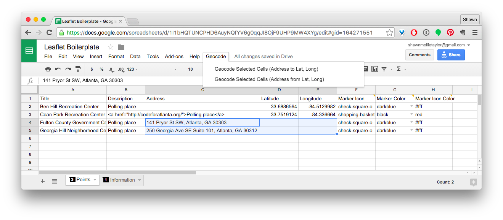

# mapsfor.us

## How to deploy your map

* Fork this repo
* Go to the [google doc template](https://docs.google.com/spreadsheets/d/1I1bHQTUNCPHD6AuyNQfYV6g0qqJI8OjF9UHP9MW4XYg/edit?usp=sharing)
* File -> Make a Copy
* In your Google Doc:
  * File -> Publish to the web -> (leave dropdowns as "Entire Document" and "Web page") -> Publish
  * Leave the sheets named "Points" and "Information" (or rename them in constants.js)
  * Copy the portion of your spreadsheet's URL between "https://docs.google.com/spreadsheets/d/" and the next "/" (e.g. "1dnv7mDYW1j9fX82J7\_n-11PtOO1lC7szXhNSo7lcDnk" from "https://docs.google.com/spreadsheets/d/1dnv7mDYW1j9fX82J7_n-11PtOO1lC7szXhNSo7lcDnk/edit#gid=164271551")
* Change the Google Doc ID in constants.js to the string you got from the step above
* Push your change(s) to Github
* Visit http://*username*.github.io/*repository*

## How to get latitudes and longitudes
For the map to map locations, the locations need coordinates. For any points where you want to get the latitude and longitude, you can obtain coordinates by doing the following:

* Highlight the address, latitude, and longitude columns
* Geocode -> Geocode Selected Cells (Address to Lat, Long)
* Wait

## How to customize your map

In your google spreadsheet:

* Marker: [any Font Awesome icon name](https://fortawesome.github.io/Font-Awesome/icons/)
* Marker colors: red, darkred, lightred, orange, beige, green, darkgreen, lightgreen, blue, darkblue, lightblue, purple, darkpurple, pink, cadetblue, white, gray, lightgray, black
* Marker icon colors: [any CSS name or hex code](http://www.w3schools.com/colors/colors_names.asp) (e.g. red or #f00)

## Built on 

* [Leaflet](http://leafletjs.com/reference.html)
* [Leaflet Awesome Marker](https://github.com/lvoogdt/Leaflet.awesome-markers)
* [Fonts]
	* [Font Awesome](https://fortawesome.github.io/Font-Awesome/)
* [Leaflet.markercluster](https://github.com/Leaflet/Leaflet.markercluster)
* [leaflet-providers](https://github.com/leaflet-extras/leaflet-providers)
* Google Docs
* [Tabletop](https://github.com/jsoma/tabletop)
* [Google Sheets Geocoding Macro](https://github.com/nuket/google-sheets-geocoding-macro)

## [To do list](https://waffle.io/codeforatlanta/mapsforus)
